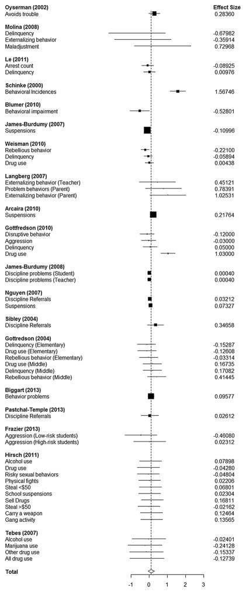
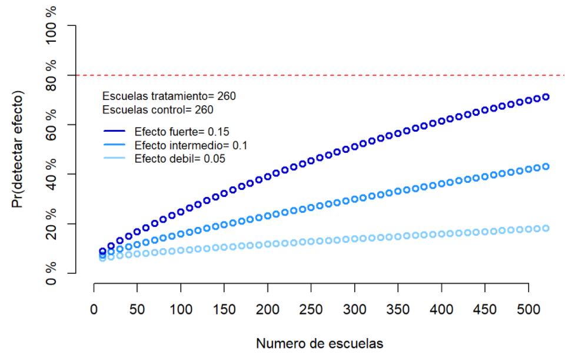

```{r setup, include=FALSE}
knitr::opts_chunk$set(echo = TRUE)
library(pwr)
```


<br>

# Análisis de Poder para Jugando a Ser Artistas 2021

<!-- * **Numero de escuelas intervenidas** -->
<!-- * **Numero promedio de estudiantes por escuela** -->
<!-- * **Varianza de estudiantes por escuela** -->


<!-- Cargar los paquetes que vamos a necesitar -->

```{r, echo=FALSE, warning=FALSE, message=FALSE}
# Instalar paquetes

# Cargar paquetes 
library(gsheet)    # Google sheets
library(dplyr)     # Manejo de datos
library(tidyr)     # Manejo de datos
library(tidyverse)     # Manejo de datos
```


<br>


<!-- # Cargar el paquete "Cluster Power" -->

```{r, echo=FALSE, warning=FALSE}
# Cargar el paquete
library(clusterPower)

```


El analisis de poder es un ejercicio estadistico que permite identificar la pobiabilidad de detectar el efecto de una intervencion con base en el diseno de la misma.  Esta valoracion permite identificar las fortalezas y debilidades del diseno de intervencion y abre la oportunidad par amejorar su diseno a fin de maximizar la posibilidad de detectar su impacto.

Este documento presenta el analisis de poder para estimar la probabilidad de identificar el impacto del projecto Jugando a Ser Artistas 2021, dentro del marco del programa Escuela Abierta para la Convivencia del Ministerio de Educacion de El Salvador.


<br>
<br>

# Efecto de Intervenciones Similares

Antes de concentrarse en el projecto Jugando a Ser Artistas de El Salvador, es necesario identificar que tipo de efecto tienen programas similares.  Esto nos permite tener un marco de comparacion para saber aproximadamente que esperar como resutlado de esta intervencion.

El estudio de [Kremer et al. (2015)](https://pubmed.ncbi.nlm.nih.gov/25416228/) analiza el efecto de 24 intervenciones de programas de escuela abierta para juventudes en riesgo.  El estudio muestra los siguientes resultados comparando el efecto de distintas intervenciones sobre distintos tipos de comportamientos. 

La grafica presenta los resultados de distintos proyectos. Las estimaciones a la derecha de la linea vertical corresponden a efectos positivos. Las estimaciones a la izquierda indican resultados negativos. Las barras horizontales de cada estimacion representan los intervalos de confianza. Mientras mas largas sean los intervalos de confianza, hay mayor incertidumbre respecto a la estimacion. En contraste, los intervalos de confianza mas estrechos indican mayor certidumbre del punto de estimacion.

Los resultados del meta-analisis indican que en promedio, estos proyectos tienen un pequeno efecto que no es estadisticamente significativo. El **efecto promedio es de 0.11** desviaciones estandar.

La comparacion de estos estudios incluye distintos tipos de comportamientos. Algunas intervenciones tuvieron efectos positivos y claramente identificables en algunos de estos comportamientos. En otros casos, las intervenciones tuvieron efectos negativos, tambien identificables.  En otras intervenciones, el efecto no posible diferenciar el efecto ya sea porque los intervalos de confianza son demasiado amplios o porque el efecto es muy cercano a cero. 


 


<br>
<br>

## Correlación entre estudiantes por escuela

En los estudios de grupos (clusters), es importante considerar qué tanto se influencian unos a otros los miembros individuales de cada grupo.

En investigacion escolar, el salon de clase o la escuela se puede considerar como el cluster a partir del cual se calcula el grado de influencia que tienen los alumnos entre unos y otros dentro de cada cluster.

Tecnicamente, el grado de influencia entre alumnos se llama Intra-Cluster Correlation (ICC).  Esto se mide con un indicador entre 0 y 1, donde 0 significa que no hay nada de influencia entre alumnos y 1 significa que hay total influencia entre alumnos.

Mientras mayor sea el ICC es mas dificil identificar el efecto de una intervencion porque la alta interaccion entre alumnos dificulta distinguir si el efecto observado se explica por la intervencion en si misma o se debe a la influencia entre estudiantes.

En estos momentos no tenemos un estimado del ICC para centros escolares en El Salvador, por lo que debemos utilizar otros estudios.

El estudio de Zopluoglu (2012) [ver aquí](https://www.researchgate.net/publication/262297789_A_Cross-National_Comparison_of_Intra-Class_Correlation_Coefficient_in_Educational_Achievement_Outcomes) estima que el grado de **ICC en centros descolares de El Salvador es de 0.35**.


Declarar el ICC para el Salvador:
```{r}
iccsv<-0.35
```

<br>
<br>


En estos momentos no tenemos un indicador claro del ICC. A falta de informacion objetiva, asumamos temporalmente un valor **ICC arbitrario de 0.20**.  Cuando tengamos los resultados del cuestionario de evaluacion de Jugando a Ser Artistas en 2020, podremos tener informacion mas detallada para calcular el ICC.

Declarar el ICC para el Salvador:
```{r}
icca<-0.20
```


<br>
<br>


## Declarar Parametros con 221 escuelas

Declarar numero de escuelas intervenidas y promedio de estudiantes por escuela:

```{r}
# Escuelas en grupo control
control <- 221

# Escuelas en grupo tratamiento
tratamiento <- 221

# Total de escuelas
esc.tot <-control+tratamiento

# Contador de escuelas
escuelas <- seq(from=0,to=esc.tot,by=10)

# Promedio de estudiantes por esquela
estudiantes <-  20 # promedio
```


<br>
<br>

Definir distintos efectos hipoteticos ($d$) y hacer analisis de poder. 


### Asumiendo efecto debil


Supongamos un efecto debil $d=0.05$:

```{r, warning=FALSE}
# Efecto hipotético
efecto.1 <- 0.05

# Cálculo de poder
pwr.1 <-cpa.normal(power = NA,
                   alpha = 0.1,
                   nclusters = escuelas, 
                   nsubjects = estudiantes, 
                   d = efecto.1,
                   ICC = icca,
                   vart = 5)
summary(pwr.1)
```
En un escenario de bajo impacto con 221 escuelas en tratamiento, la probabilidad de detectar el efecto  de la intervencion tendria un maximo de $16.6\%$.


<br>

### Asumiendo efecto intermedio


Supongamos un efecto intermedio $d=0.1$:
```{r, warning=FALSE}
# Efecto hipotético
efecto.2 <- 0.1

# Cálculo de poder
pwr.2 <-cpa.normal(power = NA, 
                   alpha = 0.1,
                   nclusters = escuelas, 
                   nsubjects = estudiantes, 
                   d = efecto.2,
                   ICC = icca,
                   vart = 5)
summary(pwr.2)
```

En un escenario de impacto promedio con 221 escuelas en tratamiento, la probabilidad de detectar el efecto de la intervencion es de $38.5\%$.


<br>

### Asumiendo efecto fuerte

Supongamos un efecto fuerte $d=0.15$:
```{r, warning=FALSE}
# Efecto hipotético
efecto.3 <- 0.15

# Cálculo de poder
pwr.3 <-cpa.normal(power = NA, 
                   alpha = 0.1,
                   nclusters = escuelas, 
                   nsubjects = estudiantes, 
                   d = efecto.3,
                   ICC = icca,
                   vart = 5)
summary(pwr.3)
```


En un escenario de alto impacto con 221 escuelas en tratamiento, la probabilidad de detectar el efecto de la intervencion es de $65\%$.

<br>

### Comparar efectos con 221 escuelas en tratamiento


Presentar los tres efectos en la misma grafica considerando 200 escuelas y 25 estudiantes promedio por escuela.

```{r, warning=FALSE, echo=FALSE, fig.height = 5, fig.width = 7, fig.align = "center"}
# Graficar
plot(escuelas, pwr.1, type="b", col="skyblue1", lwd=2, axes=FALSE, ylab="", xlab="" , ylim=c(0,1))
par(new=TRUE)
plot(escuelas, pwr.2, type="b", col="dodgerblue", lwd=2, axes=FALSE, ylab="", xlab="" , ylim=c(0,1))
par(new=TRUE)
plot(escuelas, pwr.3,type="b", lty = 1, col="mediumblue", lwd=2, axes=FALSE,
     xlab="Numero de escuelas", ylab="Pr(detectar efecto)", ylim=c(0,1))
abline(h=0.8, col="red", lty=2)
axis(1,at=c(seq(from=0,to=esc.tot,by=50)))
axis(2,at=c(0,0.2,0.4,0.6,0.8,1),labels=paste(c(0,20,40,60,80,100),"%"))
text(0, 0.65, paste("Escuelas tratamiento=",tratamiento,
                     "\nEscuelas control=",control,
                     "\nPromedio estudiantes=",estudiantes), cex=0.8, pos = 4)
legend(0, 0.63, legend=c(paste("Efecto fuerte=",efecto.3),
                           paste("Efecto intermedio=",efecto.2),
                           paste("Efecto debil=",efecto.1)),
       col=c("mediumblue", 
             "dodgerblue", 
             "skyblue1"), lwd=2:2, lty=1:1, cex=0.8, box.lty=0)

```


 


El analisis de poder indica que con 221 escuelas en tratamiento y 221 en control, considerando un promedio de 20 alumnos en el programa Jugando a Ser Artisas, la probabilidad de detectar el efecto de la intervencion es muy baja.

El analisis comparativo de programs de escuela abierta muestra que este tipo de intervenciones tiene un efecto del $0.11$ desviaciones estandard.  Lo cual es un impacto modesto y dificil de detectar.

Si asumimos que el programa Jugando a Ser Artistas tiene un impacto promedio, la probabilidad de detectar el efecto de la intervencion es apenas del $38.5\%$. Lo cual esta muy por debajo de la probabilidad ideal de deteccion del $80\%$ (ver linea roja punteada).

Bajo estas condiciones, va a ser dificil identificar el efecto de la intervencion.  

Se recomienda explorar alternativas para aumentar la posibilidad de detectar el efecto.


<br>
<br>


## Escenarios alternativos

Dado que el escenario actual ofrece una oportunidad limitada para identificar el impacto de la intervencion, se sugiere explorar alternativas para aumentar la probabilidad de detectar su impacto. Obviamente estas consideraciones deben tomar en cuenta las prioridades y limitaciones de presupuesto, logistica e institucionales.

**Limitantes que es dificil alterar:**

* Techo presupuestario.
   * El numero de escuelas ya esta definido.
* Intervencion ya esta definida.
   * Se recomienda priorizar la evaluacion de Jugando a Ser Artisas en modalidad presencial. Es posible que esta tenga mayor impacto.
   * Hay menor probabilidad de identificar efecto de paquetes escolares.


**Explorar la posibilidad de:**

* Aumentar el numero de escuelas por lo menos a 300 centros educativos para la intervencion presencial de Jugando a Ser Artistas.
   * Explorar la posibilidad de aumentar la cobertura de Jugando a Ser Artistas por medio de otros implementadores ademas del Colectivo Munecos.
* Tratar de maximizar el impacto del proyecto concentrando la intervencion en focos rojos.
   * Se asume que es mas facil detectar la reduccion de un comportamiento que tiene alta incidencia en comparacion con un comportamiento que es de baja incidencia.
      * No es garantia de poder detectar efecto.
   * Se necesita informacion mas detallada y actualizada para definir las escuelas en focos rojos.
      * Conseguir datos del Observatorio que haya disponibles.
      * Conseguir datos geo-referenciados de la Policia Nacional si es que los hay.
   * Implementar el proyecto en focos rojos implica un reto logistico.


**Efectos heterogeneos:**

* Dado el numero limitado de centros escolares actualmente contemplados, el analisis de poder indica que va a ser dificil identificar el efecto del programa.
   * Esto es en el supuesto que el proyecto tiene un efecto promedio de $0.10$ desviaciones estandar.
* Sin embargo, existe la posibilidad de poder identificar efectos heterogeneos, es decir distintos, en funcion de distintos comportamientos.
* Para maximizar la posibilidad de detectar impacto en algunas dimensiones, es importante medir varios tipos de comportamientos.
   * Los cuestionarios actualmente disenados para la linea basal nos van a brindar informacion acerca de:
      * Estados emocionales de estres y ansiedad.
      * Victimizacion de violencia verbal, fisica y sexual por parte de adultos y pares.
      * Asociacion con pandillas.
      * Aislamiento social.
      * Mecanismos de coptacion frente a situaciones problematicas.
   * Adicionalmente, seria conveniente considerar otros tipos de comportamiento a nivel de estudiante tales como:
      * Aprovechamiento academico (calificaciones).
      * Ausentismo.
      * Problemas de conducta.
      


<br>
<br>
<br>
<br>
<br>
<br>
